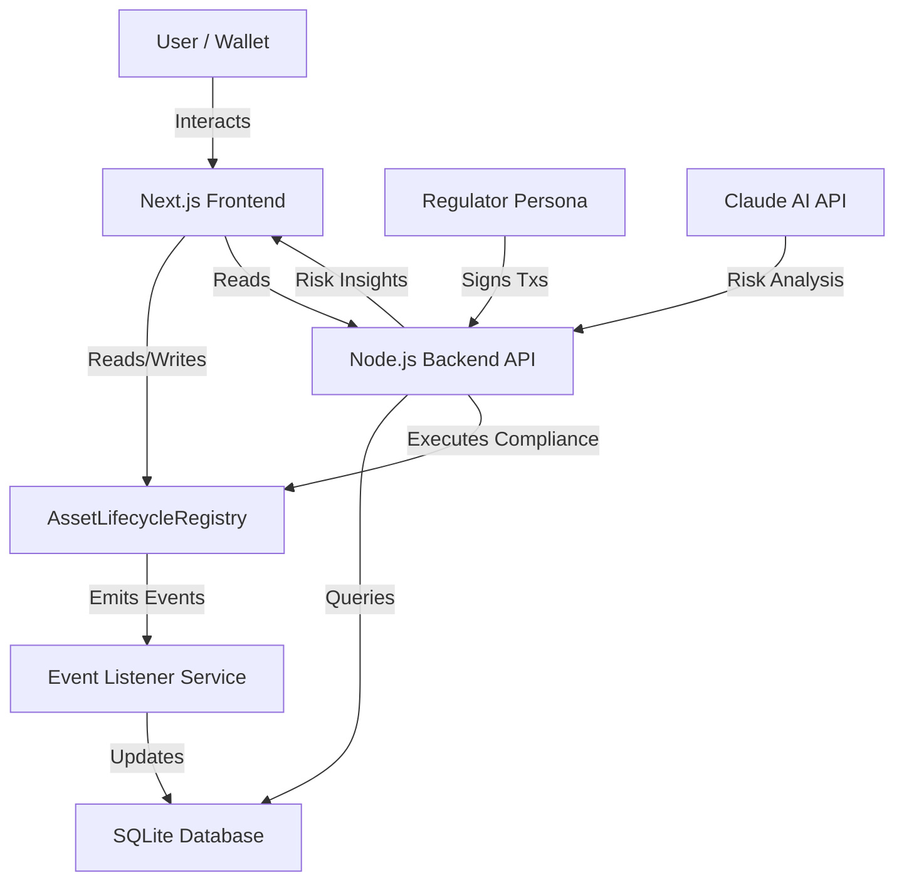

# 🌐 Finternet: Compliance-Aware Asset Lifecycle


> **The Future of Finance**: A Real-World Asset (RWA) Tokenization Dashboard bridging the gap between Issuers, Regulators, and Investors. Now with AI-powered risk assessment.

## 🚀 Overview

Finternet is a full-stack decentralized application (dApp) that manages the complete lifecycle of tokenized assets. It enforces compliance on-chain while providing a seamless, "glassmorphic" user experience off-chain.

**Key Features:**
- **Asset Registration**: Issuers can mint real-world assets (Real Estate, Art, Bonds) as unique on-chain records.
- **Compliance Engine**: A simulated Regulator persona can "Verify" or "Freeze" assets, enforcing regulatory standards.
- **🤖 AI Risk Assessment**: Groq (Free LLaMA 2) analyzes assets during verification, providing risk scores and recommendations.
- **Lifecycle Management**: Tokenization and Redemption flows gated by strict smart contract state machines.
- **Real-Time Sync**: A Node.js backend listens to blockchain events to maintain a high-performance off-chain index.

## ✨ What's New (v2.0)

### New Features
- **AI-Powered Risk Assessment** - Claude AI analyzes assets for compliance and market risks
- **Dynamic Contract Address Loading** - Frontend automatically fetches contract address from backend
- **Asset Description Generation** - AI auto-generates professional metadata
- **Compliance Checklist** - Asset-type-specific compliance checklists powered by AI

### Bug Fixes & Improvements
- ✅ Fixed hardcoded contract address issue
- ✅ Fixed registration revert errors by ensuring proper ISSUER authorization
- ✅ Fixed MetaMask disconnect persistence with wallet_revokePermissions
- ✅ Enhanced error handling with graceful fallbacks
- ✅ Improved logging and debugging throughout the stack

## 🏗 Architecture



## 🛠 Tech Stack

- **Blockchain**: Hardhat, Solidity, Ethers.js v6
- **Frontend**: Next.js 14 (App Router), Tailwind CSS (Glassmorphism), SWR
- **Backend**: Node.js, Express, SQLite
- **AI**: Groq (Free Open-Source LLaMA 2) - No cost, completely free
- **DevOps**: GitHub Actions, Monorepo structure

## ⚡ Quick Start

### Prerequisites
- Node.js v18+
- MetaMask (Browser Extension)
- Git
- Groq API key (free, get at https://console.groq.com)

### Installation

1.  **Clone the Repository**
    ```bash
    git clone https://github.com/YOUR_USERNAME/Finternet.git
    cd Finternet
    ```

2.  **Install Dependencies** (includes Claude SDK)
    ```bash
    # Install Sub-packages
    cd contracts && npm install
    cd ../backend && npm install
    cd ../frontend && npm install
    ```

3.  **Set Up Groq (Free Open-Source AI)**
    ```bash
    cd backend
    echo "GROQ_API_KEY=your_free_api_key" >> .env
    # Get free key: https://console.groq.com (no payment needed)
    cd ../frontend
    echo "NEXT_PUBLIC_API_URL=http://localhost:5000" > .env.local
    ```

4.  **Start the Blockchain (Terminal 1)**
    ```bash
    cd contracts
    npx hardhat node
    ```

5.  **Deploy Smart Contracts (Terminal 2)**
    ```bash
    cd contracts
    npx hardhat run scripts/deploy.js --network localhost
    ```

6.  **Start Backend Service (Terminal 3)**
    ```bash
    cd backend
    npm start
    # Shows: "✓ AI features enabled" if GROQ_API_KEY is set
    ```

7.  **Start Frontend Dashboard (Terminal 4)**
    ```bash
    cd frontend
    npm run dev
    ```

8.  **Access App**: Open [http://localhost:3001](http://localhost:3001)

### Complete Setup Guide with AI Instructions
See [SETUP_WITH_AI.md](SETUP_WITH_AI.md) for detailed steps.

### Quick Command Reference
See [QUICK_COMMAND_REFERENCE.md](QUICK_COMMAND_REFERENCE.md) for copy-paste commands.

## 📚 Documentation

- **[QUICK_START_CHECKLIST.md](QUICK_START_CHECKLIST.md)** - Step-by-step workflow tests
- **[SETUP_WITH_AI.md](SETUP_WITH_AI.md)** - Complete setup with AI features
- **[QUICK_COMMAND_REFERENCE.md](QUICK_COMMAND_REFERENCE.md)** - Copy-paste commands
- **[COMPREHENSIVE_IMPROVEMENTS_SUMMARY.md](COMPREHENSIVE_IMPROVEMENTS_SUMMARY.md)** - All improvements explained
- **[PROJECT_ANALYSIS.md](PROJECT_ANALYSIS.md)** - Deep technical dive
- **[ARCHITECTURE.md](ARCHITECTURE.md)** - System design & data flow

## 🤖 AI Features (Optional)

### Risk Assessment
Regulators get AI-powered risk analysis when verifying assets:
- Risk Score (0-100)
- Risk Level (LOW/MEDIUM/HIGH/CRITICAL)
- Compliance analysis
- Actionable recommendations

### Available AI Endpoints
```bash
POST /api/ai/generate-description    # Generate asset description
POST /api/ai/assess-risk             # Analyze asset risk
GET  /api/ai/compliance-checklist/:type  # Get compliance checklist
```

## 🤝 Contributing

We welcome contributions! Please see [CONTRIBUTING.md](CONTRIBUTING.md) for details on our code of conduct and development process.

**Important**: We follow [Conventional Commits](https://www.conventionalcommits.org/) for all commit messages.

## 📄 License

This project is licensed under the MIT License - see the [LICENSE](LICENSE) file for details.

## 🎯 Roadmap

- [ ] Multi-signature governance for verification
- [ ] Enhanced KYC/AML integration
- [ ] Support for more asset types (Commodities, Infrastructure)
- [ ] Testnet deployment (Sepolia)
- [ ] Advanced analytics dashboard
- [ ] Real-time notifications
